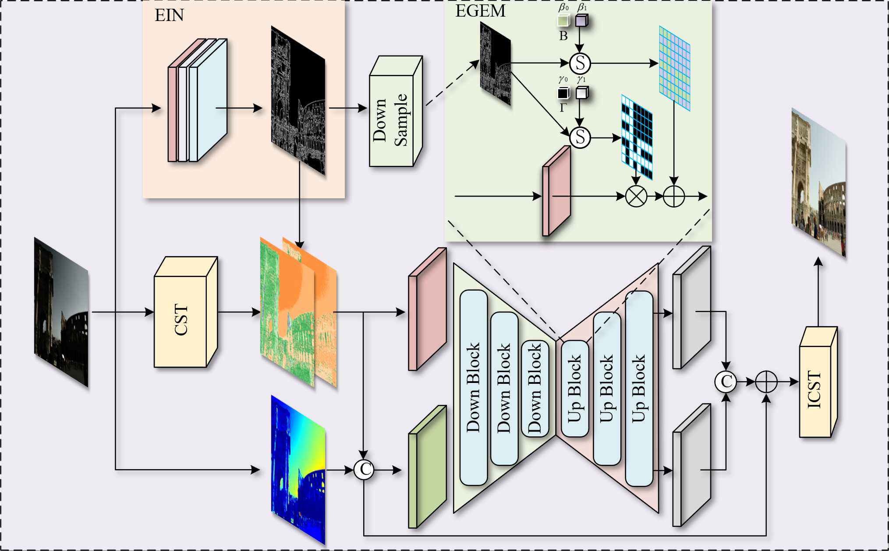
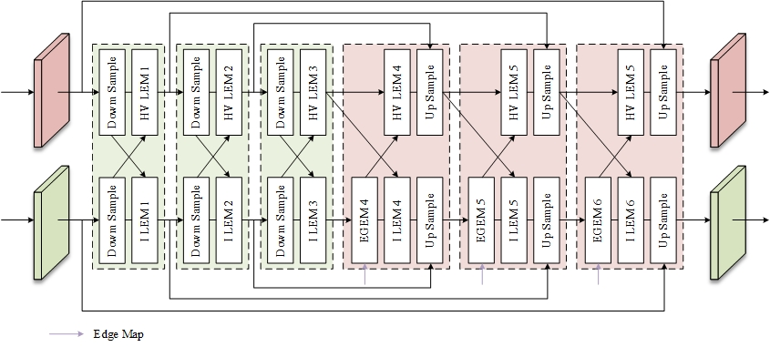
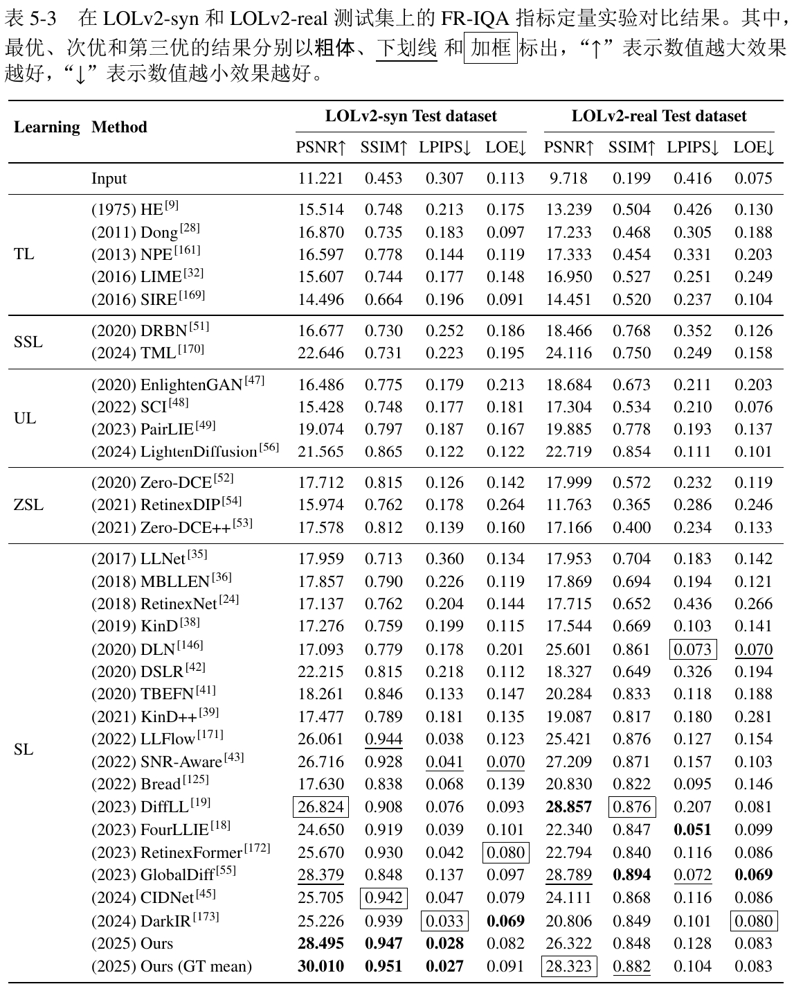
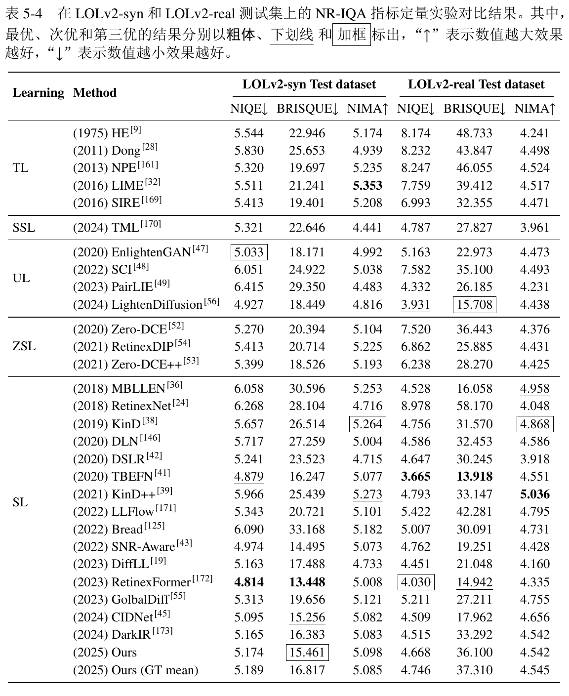
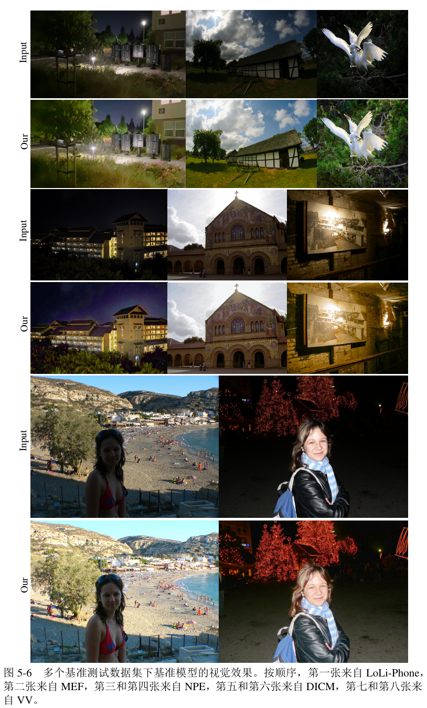

## Introduction

Low-light image enhancement is essential for downstream vision tasks such as surveillance, biometric recognition, and autonomous driving. However, challenges like low signal-to-noise ratio, weak local contrast, and color distortion make accurate restoration—especially in dark regions—difficult. Existing methods often use edge features as priors, but they underutilize edge information during feature fusion, leading to suboptimal results.

This project proposes an edge-prior guided low-light enhancement framework that addresses both edge detail restoration and multi-objective optimization (brightness, noise, and color). Our key contributions include:

* **Edge Inference Network (EIN)**: A GAN-based edge detector enhanced from DexiNed with a new Block0 module and lightweight attention to extract reliable edge maps under low-light conditions.

* **Edge-Guided Enhancement**: A dual-branch enhancement network integrates edge priors with a color-aware module in HSV space for adaptive color correction and contrast enhancement.

* **Performance**: Our model achieves state-of-the-art results on LOLv2 Synthetic **(PSNR 30.01, SSIM 0.951)** and shows strong generalization on high-resolution datasets like SICE and CID.

This work provides a unified and effective solution for enhancing dark-region details and global image quality in low-light scenarios.

## Network Architecture

The overall network structure is shown in the figure below.



The structure of the dual-branch encoder-decoder network structure(DBED) is shown in Fig.



## Directory

The following is an explanation of the role of the files in the directory.

```bash
LLIE-EGCSO/
├── checkpoints/                   # 存放训练好的模型
│   ├── EdgeNet/                   # 存放边缘推测网络的模型权重
│   └── EGCSO/                     # 存放EGCSO模型的权重
├── datasets/                      # 存放数据集
│   ├── LOLv2/                     # 存放LOLv2数据集
│   │   ├── Real_captured/         # LOLv2 Real_captured 数据集
│   │   │   ├── Train/             # LOLv2 Real_captured 训练集
│   │   │   │   ├── Low/           # LOLv2 Real_captured 训练集低光图像
│   │   │   │   ├── Normal/        # LOLv2 Real_captured 训练集正常光照图像
│   │   │   │   └── Normal_edge/   # LOLv2 Real_captured 训练集正常光照图像的边缘图像
│   │   │   └── Test/              # LOLv2 Real_captured 测试集 
│   │   │       ├── Low/           # LOLv2 Real_captured 测试集低光图像
│   │   │       ├── Normal/        # LOLv2 Real_captured 测试集正常光照图像
│   │   │       └── Normal_edge/   # LOLv2 Real_captured 测试集正常光照图像的边缘图像
│   │   └── Synthetic/             # LOLv2 Synthetic 数据集
│   │       ├── Train/             # LOLv2 Synthetic 训练集
│   │       │   ├── Low/           # LOLv2 Synthetic 训练集低光图像
│   │       │   ├── Normal/        # LOLv2 Synthetic 训练集正常光照图像
│   │       │   └── Normal_edge/   # LOLv2 Synthetic 训练集正常光照图像的边缘图像
│   │       └── Test/              # LOLv2 Synthetic 测试集
│   │           ├── Low/           # LOLv2 Synthetic 测试集低光图像
│   │           ├── Normal/        # LOLv2 Synthetic 测试集正常光照图像
│   │           └── Normal_edge/   # LOLv2 Synthetic 测试集正常光照图像的边缘图像
│   ├── dataloader.py              # 数据加载类
│   ├── dataset_expansion.py       # 用于拓展边缘数据集的大小
│   ├── change.py                  # 用于将文件名中的 'normal' 替换为 'low'
│   ├── check_size.py              # 用于检查边缘图片的尺寸是否与数据集图片相匹配
│   ├── darkpixle_cal.py           # 用于计算数据集中的暗区像素占比
│   └── GT_mean.py                 # GT mean 操作
├── models/                        # 存放模型代码
│   ├── __init__.py 
│   ├── loss/                      # 损失函数代码
│   │   ├── __init__.py            
│   │   ├── loss_utils.py          # 损失函数模块代码
│   │   ├── lossfunction.py        # 损失函数代码 
│   │   └── vgg_arch.py            # VGG 模型代码
│   ├── module/
│   │   ├── attention.py           # 注意力模块代码
│   │   ├── BaseNet.py             # 简单的UNet网络
│   │   ├── block.py               # 定义一些基本的网络模块
│   │   ├── cbam.py                # cbam 注意力机制
│   │   ├── LBP.py                 # Lighten Back Projection 模块
│   │   ├── SPADE.py               # SPADE 模块
│   │   ├── EDADE.py               # EDADE 模块
│   │   └── transformer_util.py    # Transformer 模块
│   ├── ops/
│   │   └── iqa.py                 # 图像质量评估代码
│   ├── HVIT_ori.py                # 原始 HVIT 模型代码 （源自 CIDNet）
│   ├── HVIT.py                    # 改进的 HVIT 模型代码
│   ├── LCA.py                     # LCA 模块代码
│   ├── EGCSO.py                   # EGCSO 模型代码
│   └── EIN.py                     # EIN 模型代码
├── train/                         # 训练代码
│   ├── __init__.py                
│   ├── config.json                # 配置文件
│   ├── train_DexiNed              # DexiNed模型训练代码
│   ├── train_EIN.py               # EIN模型训练代码
│   └── train_EGCSO.py             # EGCSO模型训练代码
└── predict/                       # 预测代码
    ├── __init__.py               
    ├── inference.py               # 推理代码
    ├── predict_EGCSO.py           # EGCSO模型的预测代码
    ├── predict_EIN_result.py      # EIN模型的预测代码
    └── predict_EIN_show.py        # EIN模型的可视化代码
```

## Installation

Clone this repo.
```bash
git clone https://github.com/npukujui11/LLIE-EGCSO.git
cd LLIE-EGCSO/LLIE-EGCSO/
```

This code requires PyTorch 1.12 and python 3.9.x. Please install dependencies by
```bash
python==3.9.16
torch==1.12.1+cu113
cudatoolkit==11.3.1
Pillow==9.4.0
numpy==1.26.0
timm==0.9.16
thop==0.1.1
pyyaml==6.0
pyiqa==0.1.10
lpips==0.1.4
```

Similarly, you can install `requirements.yaml` files in Anaconda

## Dataset Preparation

### Train Datasets
Datasets including LOLv2, LSRW, SICE, SID, CID, and GladNet were used for model training in this method. You can download these data sets from the [BaiduDisk](https://pan.baidu.com/s/1QDH4-GFKRjEmVAN2_KpfXg?pwd=iigc). After downloading the dataset, put it under the `../datasets` directory.

### Test Datasets
DARK FACE, DICM, ExDark, LIME, LoLi-Phone, MEF, NPE, VV were used to benchmark our method to assess the generalizability of our proposed method. You can download these data sets from the [BaiduDisk](https://pan.baidu.com/s/1ITzofWswCAyM75byOb6X1w?pwd=vjky).

### Edge Datasets
Among them, we used the Canny operator to obtain the edge images of GT based on the LOL-v2 dataset, and constructed the edge dataset from this. The edge dataset we used for training can be downloaded on the [BaiduDisk](https://pan.baidu.com/s/1WgDtuscYxfGjJn2wOZaY2g?pwd=7vqd).

## Train

### Train EIN
Before training, you need to check whether the training parameters in the `config.json` meet the requirements.

Download the edge dataset and put it into the executed file directory, and run the following code to train the EIN model.

```bash
cd train
python train_EIN.py --checkpoint "../checkpoints/EdgeNet/EIN.pth" --train_image "../datasets/LOL-v2/Real_captured/Train/Low" --train_edge "../datasets/LOL-v2/Real_captured/Train/Normal_edge"
```

Run the following code to train the generator based on the improved DexiNed model.

```bash
cd train
python train_DexiNed.py --checkpoint "../checkpoints/EdgeNet/DexiNed.pth" --train_image "../datasets/LOL-v2/Real_captured/Train/Low" --train_edge "../datasets/LOL-v2/Real_captured/Train/Normal_edge"
```

### Train DBED

If you train a DBED network with LOL-v2 Real Captured, you must take the following steps first:
1. Train the EIN model or the improved DexiNed model; 
2. Use the trained weight file to reason about all the low-light images in the LOL-v2 Real Captured data set;
3. Put the image of the inferred training data set in `../datasets/LOL-v2/Real_captured/Train/Normal_edge`;
4. Put the image of the inferred test data set to `../datasets/LOL-v2/Real_captured/Test/Normal_edge`.

> Tips: If you want to skip the EIN training step and quickly train the DBED code, you can put the GT images from the edge dataset built based on LOLv2 directly into the above directory, simply keeping the image name aligned. However, the results obtained by this final training are not the results presented by this method.

You may need to manually modify the `dataset_paths`, `checkpoint_path`, `start_epochs` and `num_epochs` parameters in `train_EGCSO.py` before executing the following code, but by default.

> If you bother, you can use the `argparse` library and set these parameters to command line arguments. On subsequent iterations I might introduce `argparse` in the code.

```bash
cd train
python train_EGCSO.py
```

## Test
### Checkpoints

The training weight of the **EIN** model has been lost and will be retrained and uploaded later. You can train the EIN model by yourself and test it with our trained DBED model weights. The weight files of the EGCSO model can be downloaded [here](https://pan.baidu.com/s/1aBvOehd2x9CTsz8MMm8iSQ?pwd=7e9f).

If you want to get the visual results of the **improved DexiNed model**, you can run the following code. Also you may need to modify the path of `image_paths` and `edge_paths` before running but usually not required. Also you need to modify the path in `checkpoint_path` and `evaluate_model()` to your corresponding path.

```bash
cd predict
python predict_DexiNed_show.py
```

After running the above code, you can see the results of the visualization.

If you just want to get the results of the **EIN model** after training, you can run the following code to save the results to the corresponding file. Before running the code you need to modify the path in `evaluate_model()` to your corresponding path.

```bash
cd predict
python predict_EIN_result.py
```

If you want to get the visualization results after the EGCSO model training, after modifying the path of `dataset_path` or `image_paths` in `predict_EGCSO.py`, you can run the following code. But only if you have taken the corresponding edge image through the EIN model and put it under the path mentioned above in Train DBED.

```bash
cd predict
python predict_EGCSO.py --ckpt_path "your checkpoint path" --output_dir "your output path" --batch_size 1
```

After running it, you can see the corresponding result in the `your output path`.

Also using `inference.py` can output the enhanced results, but compared to `predict_EGCSO.py`, the part of the visualization is deleted.

## Results

Our visualization results on multiple datasets can be downloaded at [here](https://pan.baidu.com/s/1zTeVSTTJ3wlyR1YIPcTx-A?pwd=xg27).

The visual results of the other methods can also be downloaded [here](), it mainly covers the **HE**, **Dong**, **NPE**, **LIME**, **SIRE**, **MBLLEN**, **RetinexNet**, **KinD**, **DLN**, **DSLR**, **EnlightenGAN**, **TBEFN**, **Zero-DCE**, **KinD++**, **RetinexDIP**, **RUAS**, **ZeroDCE++**, **Bread**, **LLFlow**, **SCI**, **SNR-Aware**, **DiffLL**, **GASD**, **PairLIE**, **RetinexFormer**, **CIDNet**, **DarkIR**, **LightenDiffusion**, **TML**. **If you find these results useful, please give me a star.**

* The results of our full reference image quality assessment are shown in the figure. 

* The results of our non-reference image quality assessment are shown in Fig.
  
* Visualization of the results on multiple benchmark datasets.
