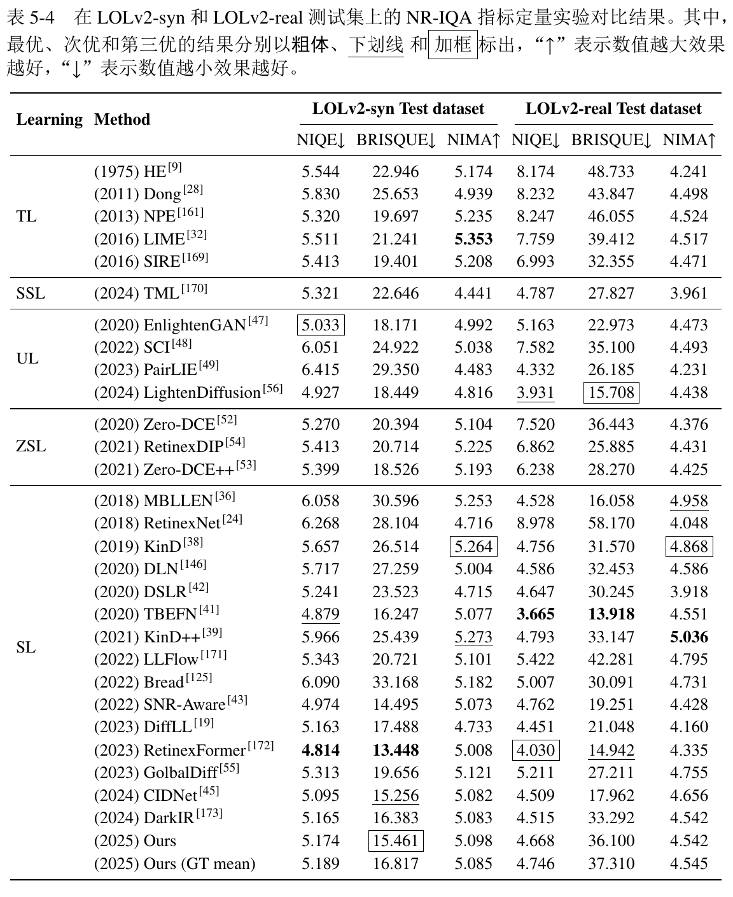

## Directory

The following is an explanation of the role of the files in the directory.

```bash
LLIE-EGCSO/
├── checkpoints/                   # 存放训练好的模型
│   ├── EdgeNet/                   # 存放边缘推测网络的模型权重
│   └── EGCSO/                     # 存放EGCSO模型的权重
├── datasets/                      # 存放数据集
│   ├── LOLv2/                     # 存放LOLv2数据集
│   │   ├── Real_captured/         # LOLv2 Real_captured 数据集
│   │   │   ├── Train/             # LOLv2 Real_captured 训练集
│   │   │   │   ├── Low/           # LOLv2 Real_captured 训练集低光图像
│   │   │   │   ├── Normal/        # LOLv2 Real_captured 训练集正常光照图像
│   │   │   │   └── Normal_edge/   # LOLv2 Real_captured 训练集正常光照图像的边缘图像
│   │   │   └── Test/              # LOLv2 Real_captured 测试集 
│   │   │       ├── Low/           # LOLv2 Real_captured 测试集低光图像
│   │   │       ├── Normal/        # LOLv2 Real_captured 测试集正常光照图像
│   │   │       └── Normal_edge/   # LOLv2 Real_captured 测试集正常光照图像的边缘图像
│   │   └── Synthetic/             # LOLv2 Synthetic 数据集
│   │       ├── Train/             # LOLv2 Synthetic 训练集
│   │       │   ├── Low/           # LOLv2 Synthetic 训练集低光图像
│   │       │   ├── Normal/        # LOLv2 Synthetic 训练集正常光照图像
│   │       │   └── Normal_edge/   # LOLv2 Synthetic 训练集正常光照图像的边缘图像
│   │       └── Test/              # LOLv2 Synthetic 测试集
│   │           ├── Low/           # LOLv2 Synthetic 测试集低光图像
│   │           ├── Normal/        # LOLv2 Synthetic 测试集正常光照图像
│   │           └── Normal_edge/   # LOLv2 Synthetic 测试集正常光照图像的边缘图像
│   ├── dataloader.py              # 数据加载类
│   ├── dataset_expansion.py       # 用于拓展边缘数据集的大小
│   ├── change.py                  # 用于将文件名中的 'normal' 替换为 'low'
│   ├── check_size.py              # 用于检查边缘图片的尺寸是否与数据集图片相匹配
│   ├── darkpixle_cal.py           # 用于计算数据集中的暗区像素占比
│   └── GT_mean.py                 # GT mean 操作
├── models/                        # 存放模型代码
│   ├── __init__.py 
│   ├── loss/                      # 损失函数代码
│   │   ├── __init__.py            
│   │   ├── loss_utils.py          # 损失函数模块代码
│   │   ├── lossfunction.py        # 损失函数代码 
│   │   └── vgg_arch.py            # VGG 模型代码
│   ├── module/
│   │   ├── attention.py           # 注意力模块代码
│   │   ├── BaseNet.py             # 简单的UNet网络
│   │   ├── block.py               # 定义一些基本的网络模块
│   │   ├── cbam.py                # cbam 注意力机制
│   │   ├── LBP.py                 # Lighten Back Projection 模块
│   │   ├── SPADE.py               # SPADE 模块
│   │   ├── EDADE.py               # EDADE 模块
│   │   └── transformer_util.py    # Transformer 模块
│   ├── ops/
│   │   └── iqa.py                 # 图像质量评估代码
│   ├── HVIT_ori.py                # 原始 HVIT 模型代码 （源自 CIDNet）
│   ├── HVIT.py                    # 改进的 HVIT 模型代码
│   ├── LCA.py                     # LCA 模块代码
│   ├── EGCSO.py                   # EGCSO 模型代码
│   └── EIN.py                     # EIN 模型代码
├── train/                         # 训练代码
│   ├── __init__.py                
│   ├── config.json                # 配置文件
│   ├── train_DexiNed              # DexiNed模型训练代码
│   ├── train_EIN.py               # EIN模型训练代码
│   └── train_EGCSO.py             # EGCSO模型训练代码
└── predict/                       # 预测代码
    ├── __init__.py               
    ├── inference.py               # 推理代码
    ├── predict_EGCSO.py           # EGCSO模型的预测代码
    ├── predict_EIN_result.py      # EIN模型的预测代码
    └── predict_EIN_show.py        # EIN模型的可视化代码
```

## Installation

Clone this repo.
```bash
git clone https://github.com/npukujui11/LLIE-EGCSO.git
cd LLIE-EGCSO/LLIE-EGCSO/
```

This code requires PyTorch 1.12 and python 3.9.x. Please install dependencies by
```bash
python==3.9.16
torch==1.12.1+cu113
cudatoolkit==11.3.1
Pillow==9.4.0
numpy==1.26.0
timm==0.9.16
thop==0.1.1
pyyaml==6.0
pyiqa==0.1.10
lpips==0.1.4
```

Similarly, you can install `requirements.yaml` files in Anaconda

## Dataset Preparation

Datasets including LOLv2, LSRW, SICE, SID, CID, and GladNet were used for model training in this method. You can download these data sets from the [BaiduDisk](https://pan.baidu.com/s/1QDH4-GFKRjEmVAN2_KpfXg?pwd=iigc). After downloading the dataset, put it under the `../datasets` directory.

DARK FACE, DICM, ExDark, LIME, LoLi-Phone, MEF, NPE, VV were used to benchmark our method to assess the generalizability of our proposed method. You can download these data sets from the [BaiduDisk](https://pan.baidu.com/s/1ITzofWswCAyM75byOb6X1w?pwd=vjky).

Among them, we used the Canny operator to obtain the edge images of GT based on the LOL-v2 dataset, and constructed the edge dataset from this. The edge dataset we used for training can be downloaded on the [BaiduDisk](https://pan.baidu.com/s/1WgDtuscYxfGjJn2wOZaY2g?pwd=7vqd).

## Train

### Train EIN
Before training, you need to check whether the training parameters in the `config.json` meet the requirements.

Download the edge dataset and put it into the executed file directory, and run the following code to train the EIN model.

```bash
cd train
python train_EIN.py --checkpoint "../checkpoints/EdgeNet/EIN.pth" --train_image "../datasets/LOL-v2/Real_captured/Train/Low" --train_edge "../datasets/LOL-v2/Real_captured/Train/Normal_edge"
```

Run the following code to train the generator based on the improved DexiNed model.

```bash
cd train
python train_DexiNed.py --checkpoint "../checkpoints/EdgeNet/DexiNed.pth" --train_image "../datasets/LOL-v2/Real_captured/Train/Low" --train_edge "../datasets/LOL-v2/Real_captured/Train/Normal_edge"
```

### Train DBED

If you train a DBED network with LOL-v2 Real Captured, you must take the following steps first:
1. Train the EIN model or the improved DexiNed model; 
2. Use the trained weight file to reason about all the low-light images in the LOL-v2 Real Captured data set;
3. Put the image of the inferred training data set in `../datasets/LOL-v2/Real_captured/Train/Normal_edge`;
4. Put the image of the inferred test data set to `../datasets/LOL-v2/Real_captured/Test/Normal_edge`.

> Tips: If you want to skip the EIN training step and quickly train the DBED code, you can put the GT images from the edge dataset built based on LOLv2 directly into the above directory, simply keeping the image name aligned. However, the results obtained by this final training are not the results presented by this method.

You may need to manually modify the `dataset_paths`, `checkpoint_path`, `start_epochs` and `num_epochs` parameters in `train_EGCSO.py` before executing the following code, but by default.

> If you bother, you can use the `argparse` library and set these parameters to command line arguments. On subsequent iterations I might introduce `argparse` in the code.

```bash
cd train
python train_EGCSO.py
```

## Test
### Checkpoints

目前EIN模型的训练权重已经丢失，后续会重新训练并上传。你可以自行训练EIN模型，并使用我们训练好的DBED模型权重进行测试。EGCSO模型的权重文件可以在[这里](https://pan.baidu.com/s/1aBvOehd2x9CTsz8MMm8iSQ?pwd=7e9f)下载。

如果你想要获取EIN模型训练后的可视化结果，你可以运行下列代码。同样的，在运行之前你可能需要修改`image_paths`和`edge_paths`的路径，但通常情况下不需要。此外还需要修改`checkpoint_path`和`evaluate_model()`中的路径为你相应的路径。

```bash
cd predict
python predict_EIN_show.py
```

运行上述代码之后，你可以看到可视化的图片结果。

如果你只是想要获取EIN模型训练后的结果，你可以运行下列代码来保存结果到相应的文件。在运行代码之前，你需要修改`evaluate_model()`中的路径为你相应的路径。

```bash
cd predict
python predict_EIN_result.py
```

如果你想要获取EGCSO模型训练后的可视化结果，修改`predict_EGCSO.py`中的`dataset_path`或`image_paths`的路径之后，你可以运行下列代码。但前提是你已经通过EIN模型获取了对应的边缘图像，并放在了上述在Train DBED中提到的路径下。
```bash
cd predict
python predict_EGCSO.py --ckpt_path "your checkpoint path" --output_dir "your output path" --batch_size 1
```
运行之后你可以在`your output path`中看到对应的结果。

同样使用`inference.py`可以输出增强的结果，但是相比于`predict_EGCSO.py`，删除了可视化的部分。


## Result

我们在多个数据集上的可视化结果可以在[这里]()下载。

* 我们结果如下图所示
* 在多个基准测试数据集上的可视化结果

